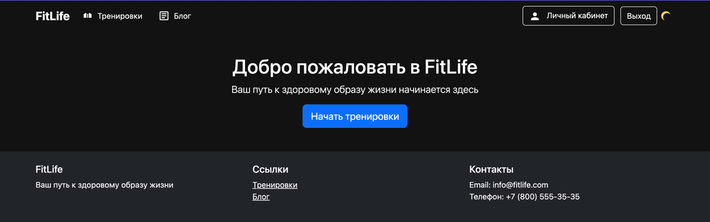
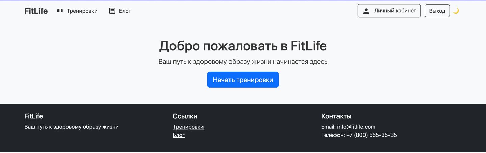

# САНКТ-ПЕТЕРБУРГСКИЙ НАЦИОНАЛЬНЫЙ ИССЛЕДОВАТЕЛЬСКИЙ УНИВЕРСИТЕТ ИТМО

## Дисциплина: фронтенд разработка

## Отчет

Домашние работы 2-4

Выполнил: Сеничев Сергей Дмитриевич
К3342

Проверил: Добряков Д. И.

## Задача

### Домашняя работа 2

Задание: улучшить доступность ранее реализованного сайта. Добавить необходимые HTML-атрибуты
ко всему контенту на странице и проверить это с помощью инструментов из Dev Tools браузера 
Firefox и сервиса Google Lighthouse.

### Домашняя работа 3

Выполнить темизацию ранее реализованного сайта. Добавить к текущему варианту сайта
дополнительную тему, в итоге должно получиться либо: светлая и тёмная с ориентиром на
пользовательские настройки. Либо две кастомные темы с переключателем через JS.

### Домашняя работа 4

Вынести все используемые ранее SVG-иконки в общий SVG-спрайт. Если иконок не было,
добавьте 3-5 иконок и поместите их в SVG-спрайт.

## Ход работы

### Доступность

Google Lighthouse выделил одну важную ошибку при анализе сайта - 
`h5`-тэг в footer части - "Элементы заголовков не расположены последовательно в порядке убывания",
что было исправлено.

### Тематизация

Смена темы осуществляется по одному тегу. В случае смены режима в main.css
`root` цвета меняются на `[data-theme="dark"]`.  

**Темная тема**  

**Светлая тема**  

### SVG спрайты

Для оптимизации работы с SVG-изображениями я создал специальный раздел, где хранятся SVG-спрайты, определенные 
через тег <symbol>. В этом разделе я разместил все спрайты, необходимые для конкретной страницы. После этого с помощью 
HTML-разметки я обозначил места, где должны отображаться определенные SVG-спрайты. Такой подход позволил вынести 
объемные фрагменты SVG-кода в отдельное место, что значительно облегчило процесс редактирования основного кода страницы.

## Выводы

В результате проделанной работы повысилось качество пользовательского опыта, улучшилась доступность контента и оптимизирована
структура кода сайта. Все поставленные задачи были успешно выполнены с использованием современных веб-технологий и лучших 
практик фронтенд-разработки.