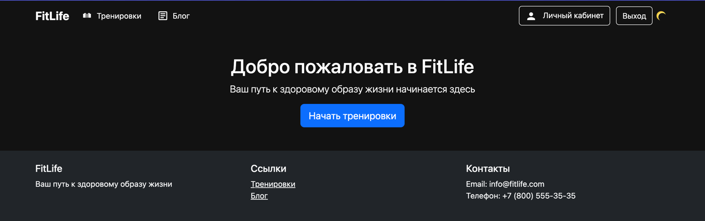
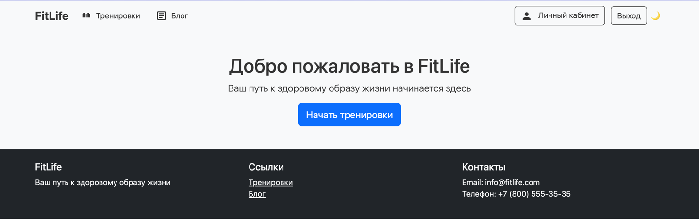

# САНКТ-ПЕТЕРБУРГСКИЙ НАЦИОНАЛЬНЫЙ ИССЛЕДОВАТЕЛЬСКИЙ УНИВЕРСИТЕТ ИТМО

## Дисциплина: фронтенд разработка

## Отчет

Домашние работы 2-4

Выполнил: Сеничев Сергей Дмитриевич
К3342

Проверил: Добряков Д. И.

## Задача

### Домашняя работа 2

Задание: улучшить доступность ранее реализованного сайта. Добавить необходимые HTML-атрибуты
ко всему контенту на странице и проверить это с помощью инструментов из Dev Tools браузера 
Firefox и сервиса Google Lighthouse.


### Домашняя работа 3

Выполнить темизацию ранее реализованного сайта. Добавить к текущему варианту сайта
дополнительную тему, в итоге должно получиться либо: светлая и тёмная с ориентиром на
пользовательские настройки. Либо две кастомные темы с переключателем через JS.

### Домашняя работа 4

Вынести все используемые ранее SVG-иконки в общий SVG-спрайт. Если иконок не было,
добавьте 3-5 иконок и поместите их в SVG-спрайт.


## Ход работы

### Доступность

Google Lighthouse выделил одну важную ошибку при анализе сайта - 
`h5`-тэг в footer части - "Элементы заголовков не расположены последовательно в порядке убывания",
что было исправлено.

До:
```html
<footer class="bg-dark text-light mt-5">
    <div class="container py-4">
        <div class="row">
            <div class="col-md-4">
                <h5>FitLife</h5>
                <p>Ваш путь к здоровому образу жизни</p>
            </div>
            <div class="col-md-4">
                <h5>Ссылки</h5>
                <ul class="list-unstyled">
                    <li><a href="/pages/workouts.html" class="text-light">Тренировки</a></li>
                    <li><a href="/pages/blog.html" class="text-light">Блог</a></li>
                </ul>
            </div>
            <div class="col-md-4">
                <h5>Контакты</h5>
                <ul class="list-unstyled">
                    <li>Email: info@fitlife.com</li>
                    <li>Телефон: +7 (800) 555-35-35</li>
                </ul>
            </div>
        </div>
    </div>
</footer>
```

После:
```html
<footer class="container py-4">
    <div class="row">
        <section class="col-md-4">
            <strong class="footer-heading d-block mb-2">FitLife</strong>
            <p>Ваш путь к здоровому образу жизни</p>
        </section>

        <nav class="col-md-4">
            <strong class="footer-heading d-block mb-2">Ссылки</strong>
            <ul class="list-unstyled">
                <li><a href="../pages/workouts.html" class="text-light">Тренировки</a></li>
                <li><a href="../pages/blog.html" class="text-light">Блог</a></li>
            </ul>
        </nav>

        <section class="col-md-4">
            <strong class="footer-heading d-block mb-2">Контакты</strong>
            <ul class="list-unstyled">
                <li>Email: info@fitlife.com</li>
                <li>Телефон: +7 (800) 555-35-35</li>
            </ul>
        </section>
    </div>
</footer>
```

### Тематизация

Смена темы осуществляется по одному тегу. В случае смены режима в main.css
`root` цвета меняются на `[data-theme="dark"]`

**Темная тема**  


```css
[data-theme="dark"] {
  --primary-color: #4dabf7;
  --secondary-color: #6c757d;
  --success-color: #198754;
  --background-color: #121212;
  --surface-color: #1e1e1e;
  --text-primary: #ffffff;
  --text-secondary: #cccccc;
  --border-color: #2d2d2d;
  --shadow-color: rgba(0, 0, 0, 0.3);
  --hover-color: rgba(13, 110, 253, 0.15);
}
```

**Светлая тема**  


```css
:root {
  --primary-color: #007bff;
  --secondary-color: #6c757d;
  --success-color: #28a745;
  --background-color: #f8f9fa;
  --surface-color: #ffffff;
  --text-primary: #333333;
  --text-secondary: #666666;
  --border-color: #eeeeee;
  --shadow-color: rgba(0, 0, 0, 0.1);
  --hover-color: rgba(0, 123, 255, 0.1);
}

```

### SVG спрайты

Для оптимизации работы с SVG-изображениями я создал специальный раздел, где хранятся SVG-спрайты, определенные 
через тег `<symbol>`. 

```html
<svg xmlns="http://www.w3.org/2000/svg" class="sprite-container" aria-hidden="true" display="none">
    <symbol id="icon-workout" viewBox="0 0 24 24">
        <path d="M6.5 6.5h3v3h-3z"/>
        <path d="M14.5 6.5h3v3h-3z"/>
        <path d="M13 8H11V16H13V8Z"/>
        <path d="M20 8H14.5V16H20V8Z"/>
        <path d="M9.5 8H4V16H9.5V8Z"/>
    </symbol>

    <symbol id="icon-blog" viewBox="0 0 24 24">
        <path d="M19 5v14H5V5h14m0-2H5c-1.1 0-2 .9-2 2v14c0 1.1.9 2 2 2h14c1.1 0 2-.9 2-2V5c0-1.1-.9-2-2-2z"/>
        <path d="M14 17H7v-2h7v2zm3-4H7v-2h10v2zm0-4H7V7h10v2z"/>
    </symbol>

    <symbol id="icon-profile" viewBox="0 0 24 24">
        <path d="M12 12c2.21 0 4-1.79 4-4s-1.79-4-4-4-4 1.79-4 4 1.79 4 4 4zm0 2c-2.67 0-8 1.34-8 4v2h16v-2c0-2.66-5.33-4-8-4z"/>
    </symbol>
</svg>
```
В этом разделе я разместил все спрайты, необходимые для конкретной страницы. 

После этого с помощью HTML-разметки я обозначил места, где должны отображаться определенные SVG-спрайты. Такой подход позволил вынести 
объемные фрагменты SVG-кода в отдельное место, что значительно облегчило процесс редактирования основного кода страницы.
```html
<a class="nav-link" href="../pages/workouts.html" aria-label="Перейти к тренировкам">
    <svg class="icon" aria-hidden="true" focusable="false">
        <use href="#icon-workout"/>
    </svg>
    Тренировки
</a>
```

```html
<a class="nav-link" href="../pages/blog.html" aria-label="Перейти в блог">
    <svg class="icon" aria-hidden="true" focusable="false">
        <use href="#icon-blog"/>
    </svg>
    Блог
</a>
```

Так как одна из иконок - иконка личного кабинета, а данная кнопка появляется только в случае,
когда пользователь авторизован, то этот HTML блок обрабатывается в файле `header.js`:
```js
if (currentUser) {
    authButtons.innerHTML = `
        <a href="../pages/profile.html" class="btn btn-outline-light me-2">
            <svg class="icon" aria-hidden="true" focusable="false">
                <use href="#icon-profile"/>
            </svg>
            Личный кабинет
        </a>
        <button onclick="handleLogout()" class="btn btn-outline-light">Выход</button>
    `;
} else {
    authButtons.innerHTML = `
        <a href="../pages/login.html" class="btn btn-outline-light me-2">Вход</a>
        <a href="../pages/register.html" class="btn btn-primary">Регистрация</a>
    `;
        }
```

## Выводы

В результате проделанной работы повысилось качество пользовательского опыта, улучшилась доступность контента и оптимизирована
структура кода сайта. Все поставленные задачи были успешно выполнены с использованием современных веб-технологий и лучших 
практик фронтенд-разработки.