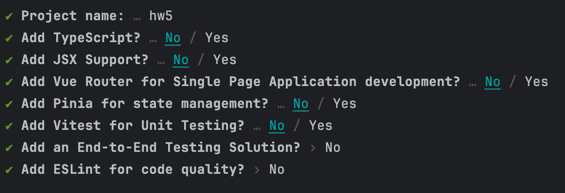
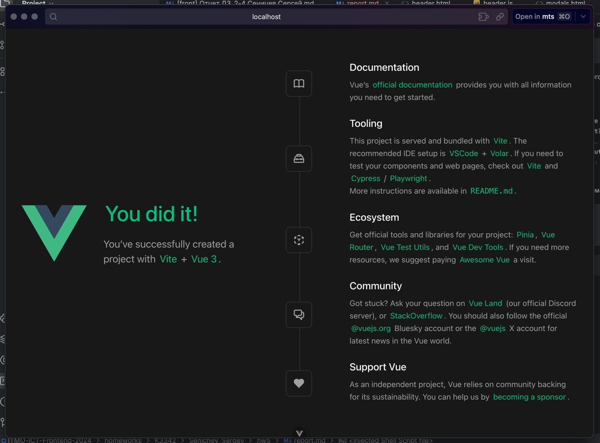
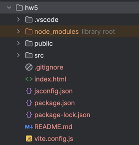

# САНКТ-ПЕТЕРБУРГСКИЙ НАЦИОНАЛЬНЫЙ ИССЛЕДОВАТЕЛЬСКИЙ УНИВЕРСИТЕТ ИТМО

## Дисциплина: фронтенд разработка

## Отчет

Домашняя работа 5

Выполнил: Сеничев Сергей Дмитриевич
К3342

Проверил: Добряков Д. И.

## Задача

### Домашняя работа 5

В рамках данной работы Вам предстоит изучить основные команды пакетного менеджера NPM и научиться стартовать проект на Vue.

## Ход работы

Для установки npm и Vue первым шагом была установка brew, далее по гайду идет установка `Node.js`:
```bash
# download and install Node.js
brew install node@22

# verifies the right Node.js version is in the environment
node -v # should print "v22.12.0"

# verifies the right npm version is in the environment
npm -v # should print "10.9.0"
```
```
echo 'export PATH="/opt/homebrew/opt/node@22/bin:$PATH"' >> ~/.zshrc
```
```bash
export LDFLAGS="-L/opt/homebrew/opt/node@22/lib"
export CPPFLAGS="-I/opt/homebrew/opt/node@22/include"
```

Далее следует установка самого Vue с помощью npm:
```bash
npm install -g @vue/cli
```

И инициализация проекта вместе с его настройкой:


После этого запускаем указанные команды, то есть:
```bash
cd hw5
npm install
npm run dev
```

В итоге получаем:


```bash
added 145 packages, and audited 146 packages in 1m

42 packages are looking for funding
  run `npm fund` for details

found 0 vulnerabilities

> hw5@0.0.0 dev
> vite


VITE v6.0.7  ready in 648 ms

➜  Local:   http://localhost:5173/
➜  Network: use --host to expose
➜  Vue DevTools: Open http://localhost:5173/__devtools__/ as a separate window
➜  Vue DevTools: Press Option(⌥)+Shift(⇧)+D in App to toggle the Vue DevTools
➜  press h + enter to show help
```

Финальная структура проекта:



## Вывод
Благодаря данной работе я научился инициализировать Vue, получил опыт работы с пакетными менеджерами
brew и npm и ознакомился с базовой структурой проекта Vue. 