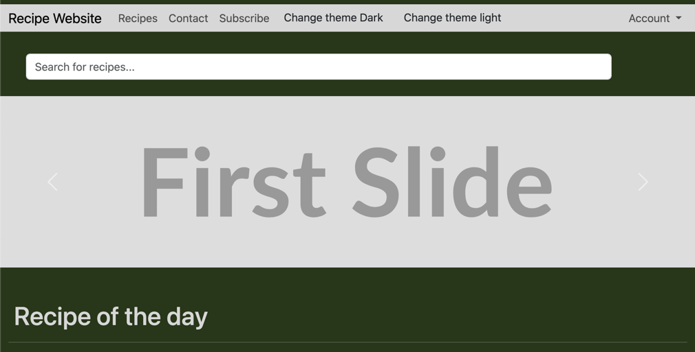
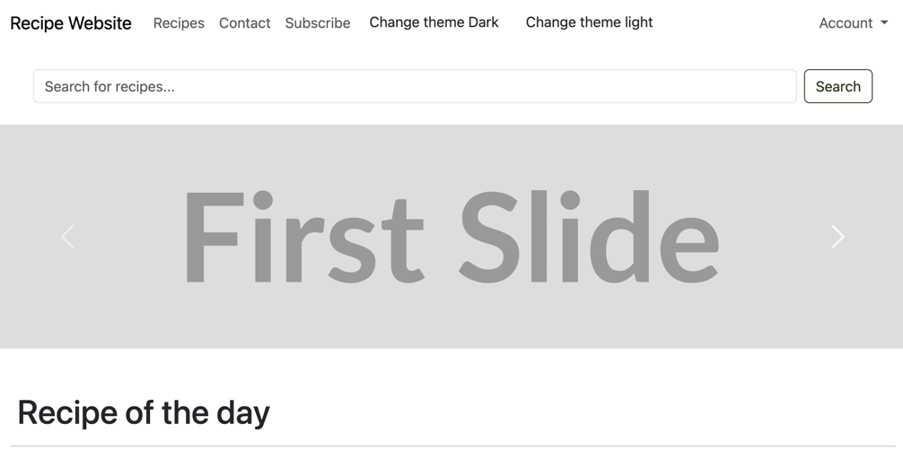
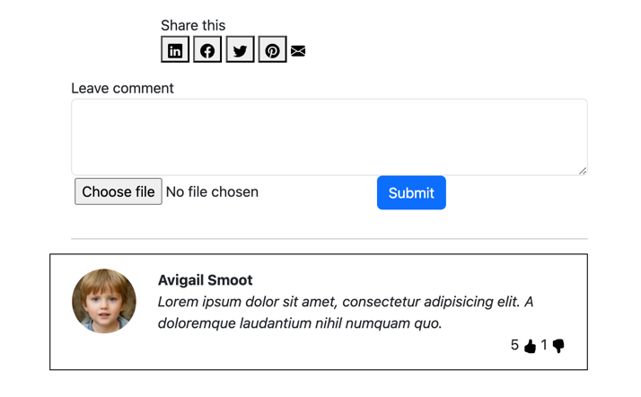

# САНКТ-ПЕТЕРБУРГСКИЙ НАЦИОНАЛЬНЫЙ ИССЛЕДОВАТЕЛЬСКИЙ УНИВЕРСИТЕТ ИТМО

## Дисциплина: фронтенд разработка

## Отчет

Домашняя/лабораторная работа 2

Выполнил: Самсонов Александр Александрович
К3343

Проверил: Добряков Д. И.

## Задача

### Домашняя работа 3

Выполнить темизацию ранее реализованного сайта. Добавить к текущему варианту сайта
дополнительную тему, в итоге должно получиться либо: светлая и тёмная с ориентиром на
пользовательские настройки. Либо две кастомные темы с переключателем через JS.

### Домашняя работа 4

Вынести все используемые ранее SVG-иконки в общий SVG-спрайт. Если иконок не было,
добавьте 3-5 иконок и поместите их в SVG-спрайт.


## Ход работы

### Тематизация

Я добавил 2 отдельных css файла, для того чтобы изменить цветовую палитру 
веб-страницы. При помощи тега `media="(prefers-color-scheme: <light/dark>)"` я 
автоматически применяю требуемую тему на страницу. Также я добавил кнопки с 
селекторами тем из примера, чтобы было удобнее тестировать результат

**Темная тема**  



**Светлая тема**  



### SVG спрайты

Я завел отдельный блок с svg спрайтами и тегом `<sybmol>` сохранил требуемые для 
данной страницы спрайты. Далее посредством следующего html кода я указал где и какие 
svg спрайты необходимо отрендерить. В результате я вынес большие куски кода svg 
спрайтов за пределы основного кода, что упростило его редактирование. 

```html

<svg class="icon">
    <use xlink:href="#<sprite_name>"></use>
</svg>
```



## Выводы

Я научился манипулировать цветовой палитрой bootstrap при помощи применения css 
переменных, что позволило кастомизировать мою страницу. Также я научился использовать 
svg спрайты для упрощения создания новой разметки и потенциального ускорения скорости 
загрузки (нет необходимости загружать одинаковые svg path's много раз). 