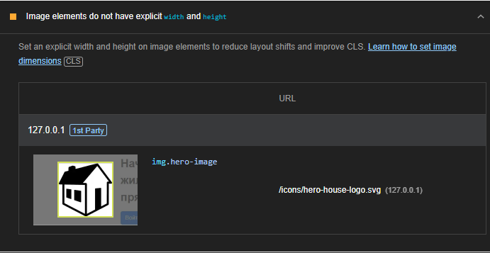

# Отчет по домашней работе #2

### Задача
Улучшить доступность ранее реализованного сайта. Добавить необходимые HTML-атрибуты ко всему контенту на странице и проверить это с помощью инструментов из Dev Tools браузера Firefox и сервиса Google Lighthouse

### Ход работы
Используя Google Lighthouse, оценим текущую доступность страниц сайта
**Cтраница логина: `index.html`**

Lighthouse предупредил, что нужно выставить ограничения размера иконки, что мы и сделаем

**Cтраница регистрации: `register.html`**

Осталась та же самая претензия к размеру иконки

**Cтраница личного кабинета: `account.html`**

**Cтраница поиска недвижимости: `property_search.html`**

### Ход работы
В ходе выполнения домашней работы я познакомился с инструментами разработчика для оптимизации сайта и внес правки в страницы сайта согласно рекомендациям сервиса Google Lighthouse