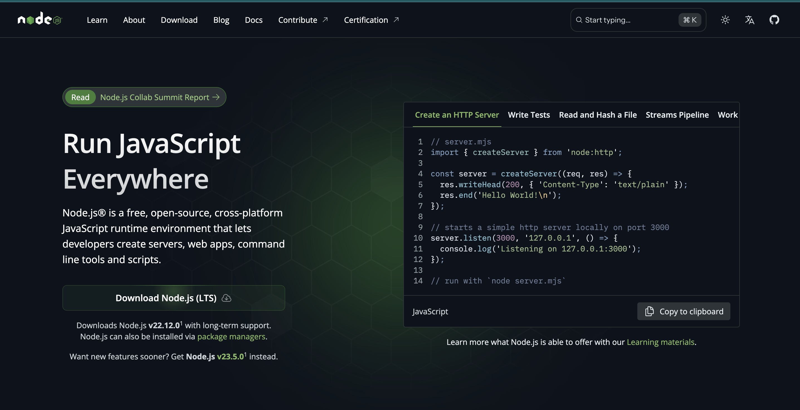
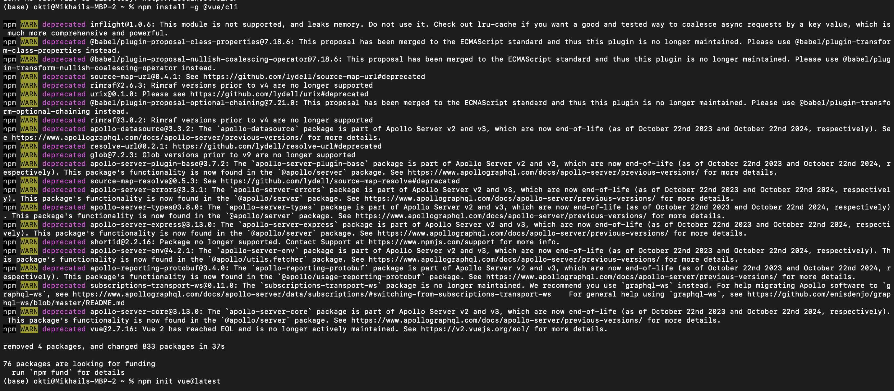
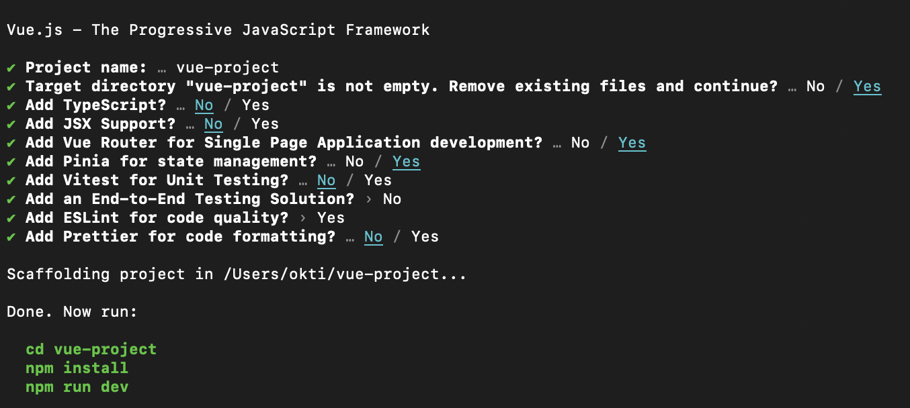
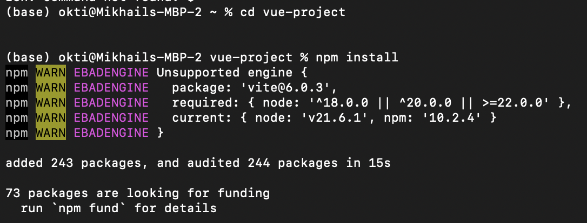
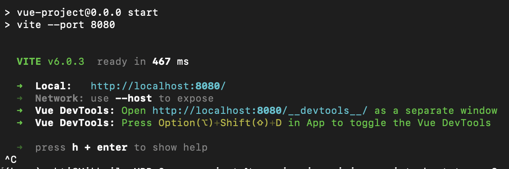

# Отчет по домашнему заданию #5. Изучение основ работы с менеджером зависимостей npm.
## Суть работы
Изучить основыне команды пакетного менеджера NPM и научиться стартовать проект на Vue

## Ход работы
Сперва мы устанавливаем node.js и npm с официального сайта 

Далее мы выполняем команду для инсталляции vue:

`npm install -g @vue/cli`

После инициализируем проект, впоследствии выбирая опции для его настройки:

`npm init vue@latest`

Из скриншота выше мы видим, что нам предлагается последовательно выполнить 3 команды: перейти в директорию проекта, установить зависимости и запустить проект.

`cd vue-project`

`npm install`

Вносим требуемые изменения в файл package.json и запускаем проект с помощью следующей команды

`npm start`

Перейдя по адресу localhost'a, мы попадаем на страницу нашего проекта

## Вывод
В ходе данной домашней работы я научился инициализировать и запускать проект на vue с необходимыми зависимостями
