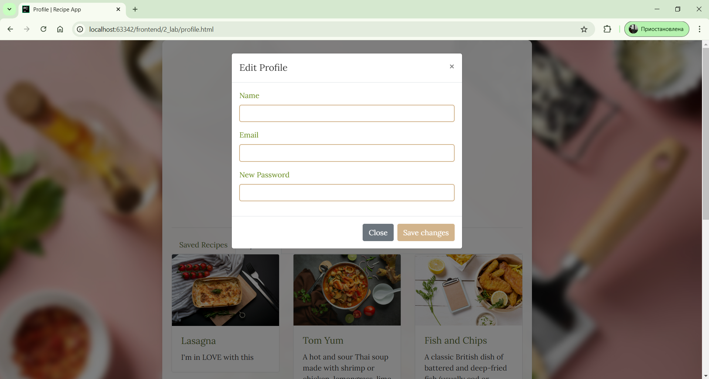

# Личный кабинет пользователя (сохраненные рецепты, публикации)


**код из файла profile.html:**
```html
<!DOCTYPE html>
<html lang="en">
<head>
  <meta charset="UTF-8">
  <meta name="viewport" content="width=device-width, initial-scale=1.0">
  <title>Profile | Recipe App</title>
  <link rel="stylesheet" href="https://stackpath.bootstrapcdn.com/bootstrap/4.5.2/css/bootstrap.min.css">
  <link rel="stylesheet" href="css/styles.css">
</head>
<body>
  <div class="container">
    <h2 class="text-center my-4">My Profile</h2>
    <div class="profile-info text-center">
      
      <h4>John Doe</h4>
      <p>Followers: 120 | Following: 80</p>
      <button class="btn btn-outline-primary" data-toggle="modal" data-target="#editProfileModal">Edit Profile</button>
    </div>
    <hr>
    <div class="tabs">
      <ul class="nav nav-tabs" id="profileTabs">
        <li class="nav-item">
          <a class="nav-link active" data-toggle="tab" href="#saved-recipes">Saved Recipes</a>
        </li>
        <li class="nav-item">
          <a class="nav-link" data-toggle="tab" href="#my-posts">My Posts</a>
        </li>
      </ul>
      <div class="tab-content">
        <div id="saved-recipes" class="tab-pane fade show active">
          <div class="row">
            <div class="col-md-4">
              <div class="card">
                <!-- Добавляем ссылку на страницу рецепта -->
                <a href="recipes/recipe_apple_pie.html">
                  
                </a>
                <div class="card-body">
                  <a href="recipes/recipe_apple_pie.html">
                    <h5 class="card-title">Autumn Apple Pie</h5>
                  </a>
                  <p class="card-text">Autumn recipe for athmosphere</p>
                </div>
              </div>
            </div>
            <!-- Другие сохраненные рецепты -->
            <div class="col-md-4">
              <div class="card">
                <a href="recipes/recipe_full_breakfast.html">
                  
                </a>
                <div class="card-body">
                  <a href="recipes/recipe_full_breakfast.html">
                    <h5 class="card-title">Full English Breakfast</h5>
                  </a>
                  <p class="card-text">A hearty British meal consisting of sausages, bacon, eggs, baked beans, grilled tomatoes, mushrooms, toast, and sometimes black pudding or hash browns.</p>
                </div>
              </div>
            </div>
                        <div class="col-md-4">
              <div class="card">
                <a href="recipes/recipe_bolognese_pasta.html">
                  
                </a>
                <div class="card-body">
                  <a href="recipes/recipe_bolognese_pasta.html">
                    <h5 class="card-title">Bolognese Pasta</h5>
                  </a>
                  <p class="card-text">An Italian dish featuring pasta served with a rich meat sauce made from ground beef, tomatoes, onions, garlic, and herbs, often topped with Parmesan cheese.</p>
                </div>
              </div>
            </div>
                        <div class="col-md-4">
              <div class="card">
                <a href="recipes/recipe_pancakes.html">
                  
                </a>
                <div class="card-body">
                  <a href="recipes/recipe_pancakes.html">
                    <h5 class="card-title">Pancakes</h5>
                  </a>
                  <p class="card-text">Fluffy, round cakes made from a simple batter of flour, milk, eggs, and baking powder, cooked on a griddle and typically served with syrup or toppings like fruit and butter.</p>
                </div>
              </div>
            </div>
          </div>
        </div>

        <div id="my-posts" class="tab-pane fade">
          <div class="row">
            <div class="col-md-4">
              <div class="card">
                <a href="recipes/recipe_lasagna.html">
                  
                </a>
                <div class="card-body">
                  <a href="recipes/recipe_lasagna.html">
                    <h5 class="card-title">Lasagna</h5>
                  </a>
                  <p class="card-text">I'm in LOVE with this</p>
                </div>
              </div>
            </div>
            <!-- Другие посты пользователя -->
            <div class="col-md-4">
              <div class="card">
                <a href="recipes/recipe_tom_yum.html">
                  
                </a>
                <div class="card-body">
                  <a href="recipes/recipe_tom_yum.html">
                    <h5 class="card-title">Tom Yum</h5>
                  </a>
                  <p class="card-text">A hot and sour Thai soup made with shrimp or chicken, lemongrass, lime leaves, galangal, chili paste, and fresh herbs, offering a balance of spicy, tangy, and savory flavors.</p>
                </div>
              </div>
            </div>
                        <div class="col-md-4">
              <div class="card">
                <a href="recipes/recipe_fish_and_chips.html">
                  
                </a>
                <div class="card-body">
                  <a href="recipes/recipe_fish_and_chips.html">
                    <h5 class="card-title">Fish and Chips</h5>
                  </a>
                  <p class="card-text">A classic British dish of battered and deep-fried fish (usually cod or haddock) served with crispy fries, often accompanied by tartar sauce and vinegar.</p>
                </div>
              </div>
            </div>
                        <div class="col-md-4">
              <div class="card">
                <a href="recipes/recipe_khinkali.html">
                  
                </a>
                <div class="card-body">
                  <a href="recipes/recipe_khinkali.html">
                    <h5 class="card-title">Khinkali</h5>
                  </a>
                  <p class="card-text">Traditional Georgian dumplings filled with seasoned ground meat (beef, pork, or lamb), herbs, and sometimes broth, boiled and served hot, eaten by hand.</p>
                </div>
              </div>
            </div>
          </div>
        </div>
      </div>
    </div>
  </div>

  <!-- Модальное окно для редактирования профиля -->
  <div class="modal fade" id="editProfileModal" tabindex="-1" aria-labelledby="editProfileModalLabel" aria-hidden="true">
    <div class="modal-dialog">
      <div class="modal-content">
        <div class="modal-header">
          <h5 class="modal-title" id="editProfileModalLabel">Edit Profile</h5>
          <button type="button" class="close" data-dismiss="modal" aria-label="Close">
            <span aria-hidden="true">&times;</span>
          </button>
        </div>
        <div class="modal-body">
          <form>
            <div class="form-group">
              <label for="editName">Name</label>
              <input type="text" class="form-control" id="editName">
            </div>
            <div class="form-group">
              <label for="editEmail">Email</label>
              <input type="email" class="form-control" id="editEmail">
            </div>
            <div class="form-group">
              <label for="editPassword">New Password</label>
              <input type="password" class="form-control" id="editPassword">
            </div>
          </form>
        </div>
        <div class="modal-footer">
          <button type="button" class="btn btn-secondary" data-dismiss="modal">Close</button>
          <button type="button" class="btn btn-primary">Save changes</button>
        </div>
      </div>
    </div>
  </div>

  <!-- Кнопка для перехода к другим рецептам -->
  <div class="text-center my-4">
    <a href="search.html" class="btn btn-light">Show other recipes</a>
  </div>


  <script src="https://code.jquery.com/jquery-3.5.1.slim.min.js"></script>
  <script src="https://cdn.jsdelivr.net/npm/@popperjs/core@2.9.2/dist/umd/popper.min.js"></script>
  <script src="https://stackpath.bootstrapcdn.com/bootstrap/4.5.2/js/bootstrap.min.js"></script>
  <script src="js/scripts.js"></script>
</body>
</html>

```

**Страница личного кабинета пользователя на скриншоте**

**My posts пользователя на скриншоте**

**Редактирование профиля пользователя на скриншоте**


